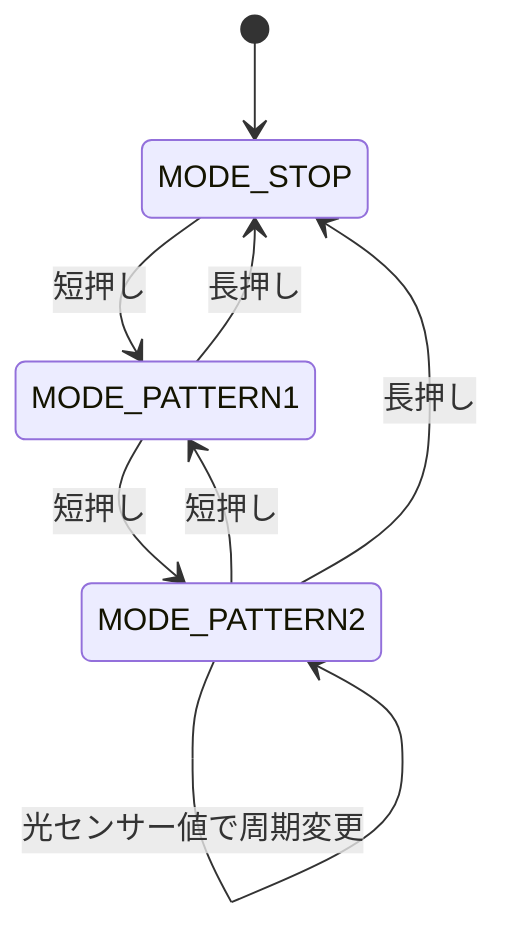

# Arduino LED Control with Light Sensor

Arduino UNO R4 Minimaを使用し、ボタン入力と光センサー入力によってLEDの点滅モードを制御する組み込み制御プログラムです。

短押しで点滅モードを切り替え、長押しで停止します。  
また、光センサーの値に応じてLEDの点滅周期を変化させる機能を実装しています。

---

## 概要

本プログラムでは、以下の機能を実装しています。

- ボタン入力によるモード切替
- 長押しによる停止制御
- ボタン入力のチャタリング対策
- `millis()` を用いた非ブロッキング制御
- `enum` による状態管理
- 光センサーによる点滅周期の可変制御
- シリアル出力によるセンサー値・点滅周期の確認

単純なLED点滅ではなく、**入力処理・状態遷移・センサー処理・出力制御を分離した構成**にしています。

---

## 使用環境

| 項目 | 内容 |
|------|------|
| マイコンボード | Arduino UNO R4 Minima |
| 開発環境 | Arduino IDE |
| 使用言語 | Arduino C/C++ |
| 入力 | ボタン、光センサー |
| 出力 | LED |
| 通信 | シリアル通信 115200bps |

---

## 使用部品

| 部品 | 用途 |
|------|------|
| Arduino UNO R4 Minima | 制御用マイコン |
| LED | 点滅表示 |
| 抵抗 220Ω〜330Ω | LED保護用 |
| タクトスイッチ | モード切替・停止操作 |
| 光センサー（CdSセル） | 明るさ検出 |
| 抵抗 10kΩ程度 | 光センサー分圧用 |
| ブレッドボード | 回路作成 |
| ジャンパ線 | 配線 |

---

## 配線

| Arduinoピン | 接続先 |
|------------|--------|
| 13 | LED制御 |
| 2 | ボタン入力 |
| A0 | 光センサー入力 |
| 5V | 光センサー側 |
| GND | LED、ボタン、光センサー抵抗側 |

---

## 回路構成

### LED

```text
13番ピン → 抵抗 → LED長い足
LED短い足 → GND
```

### ボタン

本プログラムでは `INPUT_PULLUP` を使用しているため、ボタンは5Vへ接続しません。

```text
2番ピン → ボタン → GND
```

押していないときは `HIGH`、押したときは `LOW` として読み取ります。

### 光センサー

光センサーと抵抗で分圧回路を作り、A0で電圧を読み取ります。

```text
5V → 光センサー → A0 → 抵抗 → GND
```

この構成では、明るいほどA0の値が大きくなり、暗いほど値が小さくなります。

---

## 動作仕様

### ボタン操作

| 操作 | 動作 |
|------|------|
| 短押し | モード切替 |
| 長押し（1秒以上） | 停止モードへ移行 |

---

## モード一覧

| モード | 内容 |
|--------|------|
| `MODE_STOP` | LED消灯 |
| `MODE_PATTERN1` | 固定周期で点滅 |
| `MODE_PATTERN2` | 光センサー値に応じて点滅周期を変更 |

---

## モード遷移



---

## 点滅パターン

### MODE_PATTERN1

固定周期で点滅します。

| 状態 | 時間 |
|------|------|
| 消灯 | 3000ms |
| 点灯 | 1000ms |

---

### MODE_PATTERN2

光センサーの値に応じて点滅周期が変化します。

```cpp
int adjustedSensorValue = constrain(sensorValue, 0, 150);

offTime = map(adjustedSensorValue, 0, 150, 2000, 300);
onTime  = map(adjustedSensorValue, 0, 150, 2000, 300);
```

| センサー値 | 点滅周期 |
|------------|----------|
| 小さい（暗い） | 遅い |
| 大きい（明るい） | 速い |

実測値として、通常時は約130、遮光時は約30程度だったため、`constrain()` で入力値を `0〜150` に制限し、`map()` で点滅周期へ変換しています。

---

## 設計方針

本プログラムでは、以下の4つの処理を関数ごとに分離しています。

| 関数 | 役割 |
|------|------|
| `updateButton()` | ボタン入力、チャタリング対策、短押し・長押し判定 |
| `handleMode()` | ボタンイベントに応じたモード遷移 |
| `updateSensor()` | 光センサー値の読み取り、点滅周期の更新 |
| `updateLed()` | LEDの点灯・消灯制御 |

入力処理、状態遷移、センサー処理、出力制御を分けることで、可読性と拡張性を高めています。

---

## 実装のポイント

### 1. ButtonState / ButtonEvent による管理

ボタンの状態と発生イベントを分けて管理しています。

```cpp
enum ButtonState {
  BUTTON_RELEASED,
  BUTTON_PRESSED,
  BUTTON_LONG_PRESSED
};

enum ButtonEvent {
  BUTTON_EVENT_NONE,
  BUTTON_EVENT_SHORT_PRESS,
  BUTTON_EVENT_LONG_PRESS
};
```

`ButtonState` は、ボタンが現在どの状態にあるかを表します。

| 状態 | 意味 |
|------|------|
| `BUTTON_RELEASED` | ボタンが離されている |
| `BUTTON_PRESSED` | ボタンが押されている |
| `BUTTON_LONG_PRESSED` | 長押し判定済み |

`ButtonEvent` は、今回発生した操作イベントを表します。

| イベント | 意味 |
|----------|------|
| `BUTTON_EVENT_NONE` | イベントなし |
| `BUTTON_EVENT_SHORT_PRESS` | 短押し |
| `BUTTON_EVENT_LONG_PRESS` | 長押し |

これにより、短押しと長押しを明確に分離して処理しています。

---

### 2. チャタリング対策

ボタン入力は機械的な接点の影響で、押した瞬間や離した瞬間に信号が細かく揺れることがあります。  
そのため、入力が変化した時刻を記録し、20ms以上安定した場合のみ確定状態として扱っています。

```cpp
if (currentState != lastState) {
  changeTime = currentTime;
  lastState = currentState;
}

if (currentTime - changeTime >= debounceTime) {
  if (stableState != currentState) {
    lastStableState = stableState;
    stableState = currentState;
  }
}
```

---

### 3. 短押し・長押し判定

`INPUT_PULLUP` を使用しているため、ボタンを押すと `LOW`、離すと `HIGH` になります。

- `HIGH → LOW`：押し始め
- `LOW → HIGH`：離した瞬間

押下開始時刻を `pressStartTime` に記録し、1秒以上押され続けた場合に長押しイベントを発生させます。

```cpp
if (buttonState == BUTTON_PRESSED && currentTime - pressStartTime >= longPressTime) {
  buttonEvent = BUTTON_EVENT_LONG_PRESS;
  buttonState = BUTTON_LONG_PRESSED;
}
```

長押しにならずにボタンが離された場合は、短押しイベントとして扱います。

```cpp
if (lastStableState == LOW && stableState == HIGH) {
  if (buttonState == BUTTON_PRESSED) {
    buttonEvent = BUTTON_EVENT_SHORT_PRESS;
  }

  buttonState = BUTTON_RELEASED;
}
```

---

### 4. `millis()` による非ブロッキング制御

`delay()` を使用せず、経過時間を比較してLEDのON/OFFを切り替えています。

```cpp
if (ledState == LED_OFF && currentTime - startTime >= offTime) {
  digitalWrite(ledPin, HIGH);
  startTime = currentTime;
  ledState = LED_ON;
}
else if (ledState == LED_ON && currentTime - startTime >= onTime) {
  digitalWrite(ledPin, LOW);
  startTime = currentTime;
  ledState = LED_OFF;
}
```

これにより、LED点滅中でもボタン入力やセンサー値の読み取りを継続できます。

---

### 5. 光センサー値による点滅周期変更

`MODE_PATTERN2` では、光センサーの値を読み取り、点滅周期へ変換しています。

```cpp
sensorValue = analogRead(sensorPin);

int adjustedSensorValue = constrain(sensorValue, 0, 150);
offTime = map(adjustedSensorValue, 0, 150, 2000, 300);
onTime  = map(adjustedSensorValue, 0, 150, 2000, 300);
```

センサー値が大きいほど点滅周期が短くなり、明るいほど速く点滅します。

---

### 6. シリアル出力による確認

`MODE_PATTERN2` のとき、センサー値・消灯時間・点灯時間を0.5秒ごとに出力します。

```cpp
if (currentTime - lastPrintTime >= 500) {
  lastPrintTime = currentTime;

  Serial.print(sensorValue);
  Serial.print("\t");
  Serial.print(offTime);
  Serial.print("\t");
  Serial.println(onTime);
}
```

Arduino IDEのシリアルプロッタを使用することで、センサー値と点滅周期の変化をグラフで確認できます。

---

## 動作デモ

### 1. 短押しによるモード切替


### 2. 光センサーによる点滅周期変更


### 3. 長押しによる停止


---

## 実行方法

1. Arduino IDEで本プログラムを書き込む
2. 回路を配線する
3. シリアルモニタまたはシリアルプロッタを115200bpsで開く
4. ボタンを短押ししてモードを切り替える
5. `MODE_PATTERN2` で光センサーを明るくしたり遮光したりして、点滅周期の変化を確認する
6. ボタンを1秒以上長押しして停止する

---

## 学習成果

本プロジェクトを通じて、以下を学習しました。

- GPIO入力・出力制御
- ボタン入力のチャタリング対策
- 短押し・長押し判定
- 状態とイベントを分けた設計
- `enum` による状態管理
- `millis()` を用いた非ブロッキング処理
- アナログ入力の読み取り
- `constrain()` と `map()` による入力値変換
- シリアルプロッタによる可視化
- 関数分割による責務分離

---

## 今後の改善

- センサー値のキャリブレーション機能追加
- シリアル通信によるモード変更
- 割り込み処理による入力検知への拡張
- 複数LEDを用いた状態表示
- エラー状態や警告状態の追加

---

## Author

- 名前：森　龍平
